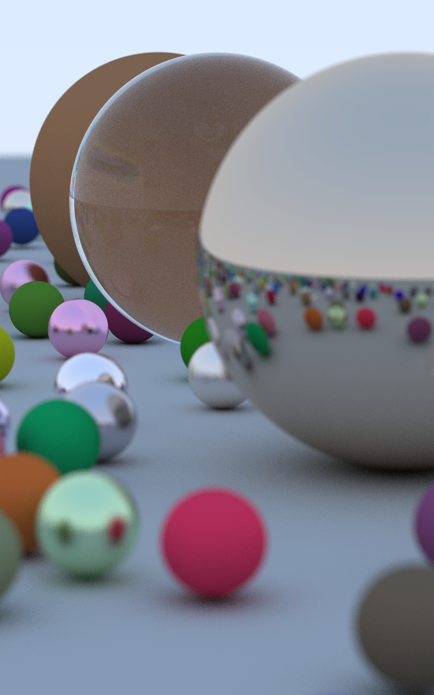

# ray
A ray-tracing engine built in C++ following the guide "Ray Tracing in One Weekend" by Peter Shirley
  - <https://raytracing.github.io/>
  - I highly recommend these guides, they make the topic very approachable

## Example render

